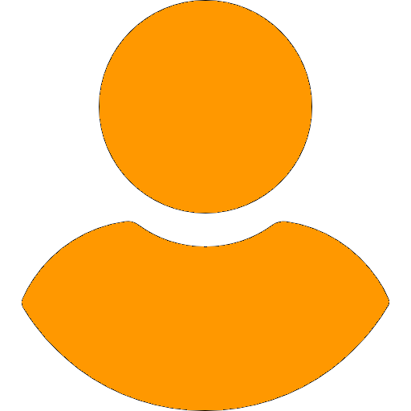

```{r setup, include=FALSE}
library(yaml)
library(htmltools)

# Leer datos del CV
cv_data <- read_yaml("cv-data.yml")
```

::: {.hero-section}
::: {.hero-content}


::: {.hero-text}
# `r cv_data$personal$nombre`

::: {.subtitle}
`r cv_data$personal$titulo`
:::

::: {.contact-info}
::: {.contact-item}
 `r cv_data$personal$email`
:::
::: {.contact-item}
 `r cv_data$personal$telefono`
:::
::: {.contact-item}
 linkedin.com/in/`r cv_data$personal$linkedin`
:::
::: {.contact-item}
 `r cv_data$personal$ubicacion`
:::
:::
:::
:::
:::


::: {.cv-container}

##  Perfil

::: {.perfil-texto}
`r cv_data$perfil$resumen`

**Con `r cv_data$perfil$anos_experiencia_laboral` años de experiencia laboral** y **`r cv_data$perfil$anos_experiencia_profesional` años de experiencia profesional**; padre de familia con `r cv_data$perfil$edad` años de edad.
:::

::: {.two-column}
::: {.sidebar}

##  Educación

```{r, echo=FALSE, results='asis'}
for (edu in cv_data$educacion) {
  cat('<div class="education-item">')
  cat('<div class="education-title">', edu$titulo, '</div>')
  cat('<div class="education-institution">', edu$institucion, '</div>')
  cat('<div class="education-date">', edu$fecha, '</div>')
  cat('</div>')
}
```

##  Certificaciones

::: {.cert-stats}
::: {.cert-stat}
::: {.cert-number}
`r cv_data$certificaciones$formacion`
:::
::: {.cert-label}
Formación
:::
:::
::: {.cert-stat}
::: {.cert-number}
`r cv_data$certificaciones$software`
:::
::: {.cert-label}
Software
:::
:::
::: {.cert-stat}
::: {.cert-number}
`r cv_data$certificaciones$eventos`
:::
::: {.cert-label}
Eventos
:::
:::
:::

##  Skills

```{r, echo=FALSE, results='asis'}
for (skill in cv_data$skills) {
  cat('<div class="software-item">')
  cat('<span class="software-name">', skill$nombre, '</span>')
  cat('<div class="level-dots">')
  for (i in 1:5) {
    if (i <= skill$nivel) {
      cat('<div class="dot"></div>')
    } else {
      cat('<div class="dot empty"></div>')
    }
  }
  cat('</div>')
  cat('</div>')
}
```

##  Software

```{r, echo=FALSE, results='asis'}
for (sw in cv_data$software) {
  cat('<div class="software-item">')
  cat('<span class="software-name">', sw$nombre, '</span>')
  cat('<div class="level-dots">')
  for (i in 1:5) {
    if (i <= sw$nivel) {
      cat('<div class="dot"></div>')
    } else {
      cat('<div class="dot empty"></div>')
    }
  }
  cat('</div>')
  cat('</div>')
}
```

##  Idiomas

```{r, echo=FALSE, results='asis'}
for (idioma in cv_data$idiomas) {
  cat('<div class="lang-container">')
  cat('<div class="lang-label">', idioma$idioma, '</div>')
  cat('<div class="lang-bar-bg">')
  cat('<div class="lang-bar-fill" style="width:', idioma$nivel, '%;"></div>')
  cat('</div>')
  cat('</div>')
}
```

:::

::: {.main-content}

##  Experiencia Profesional

```{r, echo=FALSE, results='asis'}
for (exp in cv_data$experiencia) {
  cat('<div class="experience-item">')
  cat('<div class="experience-date">', exp$fecha, '</div>')
  cat('<div class="experience-title">', exp$cargo, '</div>')
  cat('<div class="experience-company">', exp$empresa, '</div>')
  cat('</div>')
}
```


##  Referencias

```{r, echo=FALSE, results='asis'}
for (ref in cv_data$referencias) {
  cat('<div class="reference-item">')
  cat('<div class="reference-name">', ref$nombre, '</div>')
  cat('<div>', ref$cargo, '</div>')
  cat('<div style="color: #666;">', ref$email, ' | ', ref$telefono, '</div>')
  cat('</div>')
}
```


##  Intereses y Hobbies

::: {.interest-grid}
```{r, echo=FALSE, results='asis'}
for (interes in cv_data$intereses) {
  cat('<div class="interest-item">')
  cat('<div class="interest-icon">', interes$icono, '</div>')
  cat('<div>', interes$nombre, '</div>')
  cat('</div>')
}
```
:::


:::
:::
:::
